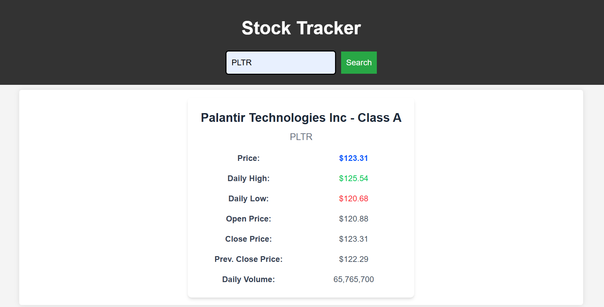
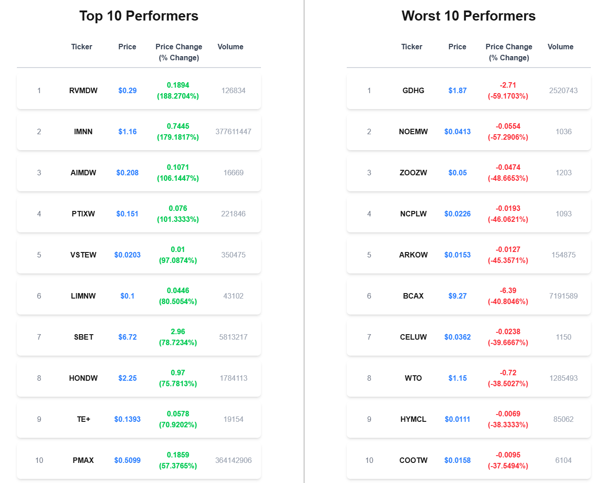

# StockTracker Frontend

StockTracker is a Next.js-based frontend application deployed on Azure Static Web Apps that fetches and displays stock performance data. It connects to an Azure Function App with three API endpoints to retrieve stock details, top performers, and worst performers of the day.

## Live Project Display
	
To view this project live, please visit the link: https://purple-ocean-0e575860f.6.azurestaticapps.net/

## Screenshots

### 1. Stock Search



### 2. Top & Worst Performers



## 🚀 Technologies Used

- **Next.js** – Framework for building the React-based frontend.
- **TypeScript** – Provides type safety and enhances development experience.
- **Tailwind CSS** – Used for styling and creating a responsive UI.
- **Azure Function App** – Backend service providing stock data via API.
- **Azure Static Web Apps** – Deploys and serves the frontend efficiently.

## 🔗 API Integration

The frontend interacts with an **Azure Function App** through three API endpoints:

1. **Stock Lookup** – Fetches stock details by searching the symbol.
2. **Top Performers** – Retrieves the top 10 performing stocks of the day.
3. **Worst Performers** – Retrieves the worst 10 performing stocks of the day.

To configure the API base URL, include the following in a `.env` file:
```
NEXT_PUBLIC_API_BASE_URL=

NEXT_PUBLIC_AZURE_CLIENT_ID=
NEXT_PUBLIC_AZURE_AUTHORITY=
NEXT_PUBLIC_AZURE_REDIRECT_URI=
```

API Routes:
```
1. /api/StockDetails
2. /api/BestPerformingStocks
3. /api/WorstPerformingStocks
```


## 💻 Running the Project
1️⃣ Clone the Repository
```
git clone <repository-url>
cd stockTrackerFrontend
``` 
2️⃣ Install Dependencies
```
npm install
```
 3️⃣ Set Up Environment Variables
 ```
Create a .env file in the root directory and add:
NEXT_PUBLIC_API_BASE_URL=
```
4️⃣ Start the Development Server
```
npm run dev
Open your browser and go to http://localhost:3000.
```

## 🌍 Deployment Process & CI/CD Integration

The deployment of the StockTracker frontend follows a structured process using **Azure DevOps**, **Azure Static Web Apps**, and **CI/CD pipelines** for automated builds and deployments.

### Deployment Steps
1. **Code Development** – The frontend application is developed using Next.js, TypeScript, and Tailwind CSS.
2. **Push to Azure DevOps Repository** – The code is committed and pushed to an Azure DevOps repository for version control.
3. **Create Azure Static Web App** – An Azure Static Web App is created and linked to the repository on Azure DevOps.
4. **Setup CI/CD Pipelines** – Azure DevOps pipelines are configured to handle the automated build and deployment process.

### How CI/CD Pipelines Works in This Deployment

#### Continuous Integration (CI):
- Whenever changes are pushed to the repository, **Azure DevOps Pipelines** trigger an automated build process.
- The pipeline installs dependencies (`npm install`) and builds the Next.js application (`npm run build`).
- If build failures occur, the pipeline prevents deployment and logs errors.

#### Continuous Deployment (CD):
- After a successful build, the pipeline deploys the compiled project to Azure Static Web Apps.
- Azure automatically provisions the necessary infrastructure for hosting the application.
- Azure Functions API is linked to the frontend, ensuring API calls are correctly routed.

## 🔧 Additional Configuration
```
1. Ensure CORS settings in Azure Functions allow requests from the frontend.

2. Setup the environment variables on Azure 

3. Monitor API Requests using browser dev tools or logs in Azure.
```
